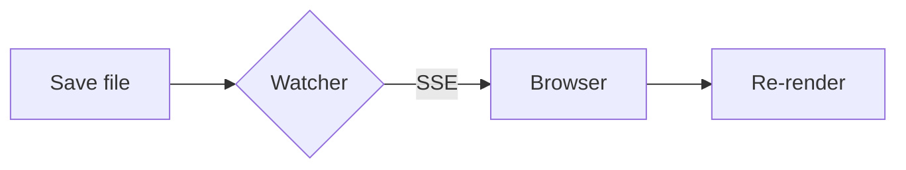

# mkserve showcase

A sample workspace covering every rendering feature. Run
`node dist/cli.mjs test/fixtures/showcase` and edit this file to try hot
reload.

## CommonMark

Paragraphs with **bold**, _italic_, `inline code`, and a [link to the
guide](docs/guide.md#usage). External links such as
[CommonMark](https://commonmark.org) open in a new tab.

> A plain blockquote.

1. Ordered
2. List

- Unordered
  - Nested

---


## GitHub Flavored Markdown

| Feature  | Supported |
| -------- | :-------: |
| Tables   |    ✅     |
| Tasks    |    ✅     |
| ~~Strike~~ |  ✅     |

- [x] Done task
- [ ] Open task

Autolink: https://example.com and a footnote.[^1]

[^1]: The footnote text.

## Math

Inline math $E = mc^2$ and a display block:

$$
\int_{-\infty}^{\infty} e^{-x^2}\,dx = \sqrt{\pi}
$$

## Mermaid

```mermaid
architecture-beta
  group app(logos:aws)[App]
  service web(logos:react)[Web] in app
  service api(devicon:nodejs)[API] in app
  service db(fa7-solid:database)[DB] in app
  service docs(material-icon-theme:markdown)[Docs] in app
  service repo(thesvg:github)[Repo]
  service image(thesvg-color:docker)[Image]
  service host(selfhst:docker)[Host]
  service build(simple-icons:vite)[Build]
  web:R --> L:api
  image:R --> L:host
  build:T --> B:web
  api:R --> L:db
  docs:B --> T:api
  repo:L --> R:web
```

```mermaid
architecture-beta
  service launch(noto:rocket)[Launch]
  service web(twemoji:globe-with-meridians)[Web]
  service pkg(fluent-emoji-flat:package)[Package]
  launch:R --> L:web
  web:R --> L:pkg
```







## Code

```ts
interface Greeting {
  name: string;
}

export function greet({name}: Greeting): string {
  return `Hello, ${name}!`;
}
```

```bash
pnpm add -g @shunya-sasaki/mkserve
mkserve --port 4000
```

```unknown-language
Falls back to plain text.
```

## Alerts

> [!NOTE]
> Useful information.

> [!TIP]
> Helpful advice.

> [!IMPORTANT]
> Key information.

> [!WARNING]
> Urgent info that needs attention.

> [!CAUTION]
> Risks or negative outcomes.

## Raw HTML

<details>
<summary>Click to expand</summary>

Hidden content.

</details>
